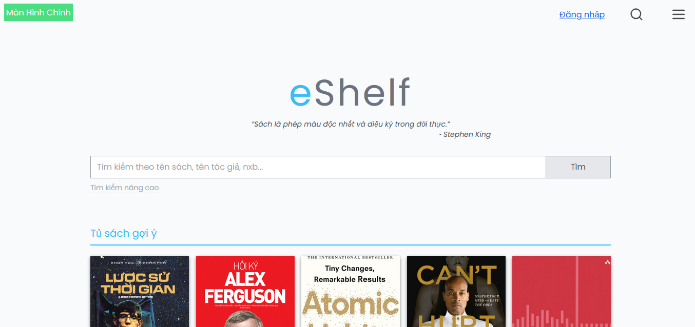
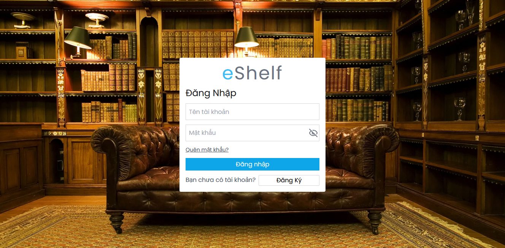
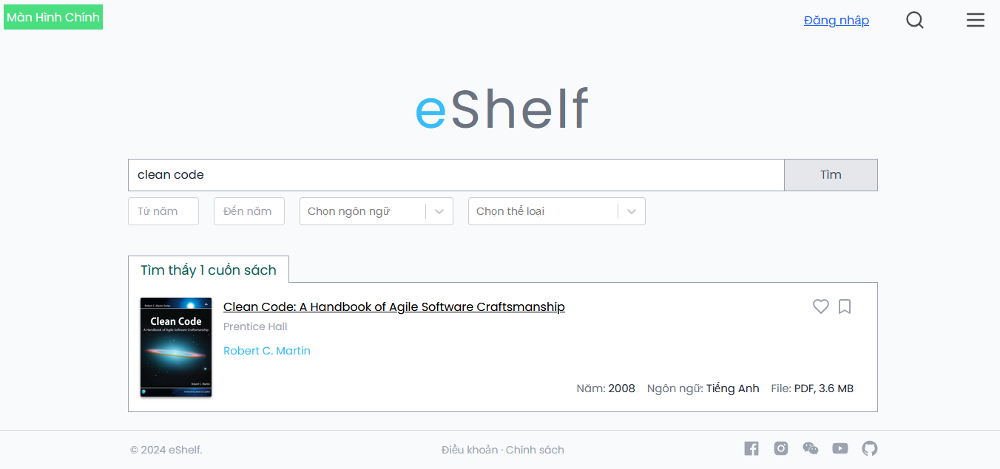
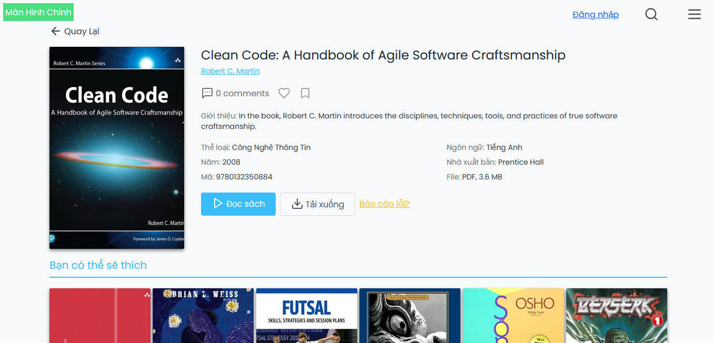
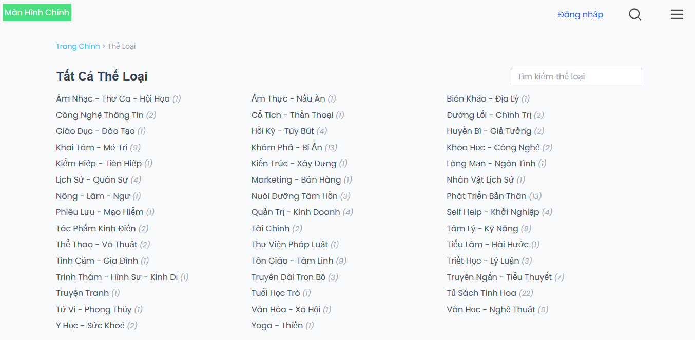
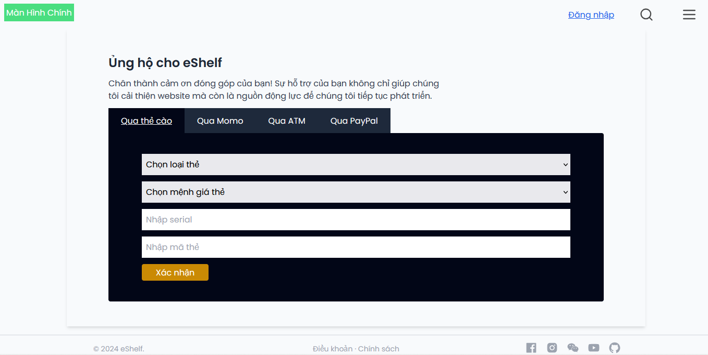
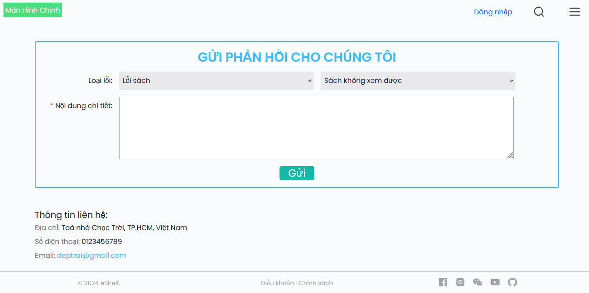

# eShelf

Đồ án môn học IE104. Website đọc sách eBooks.  
Công nghệ sử dụng: ReactJS, TailwindCSS.

## Danh sách thành viên

| MSSV     |  Họ Tên   |
| -------- | :-------: |
| 23521809 | Lê Văn Vũ |

## Hướng dẫn chạy project

**Bước 1**: Cài đặt [Node.js](https://nodejs.org/en/)

**Bước 2**: Clone project về máy

```sh
git clone https://github.com/levanvux/eShelf.git
```

**Bước 3**: Chạy các lệnh sau trong terminal

```sh
npm install
npm run dev
```

**Bước 4**: Chạy địa chỉ được cung cấp vào trình duyệt, thông thường địa chỉ sẽ là

```sh
http://localhost:5173/
```

## Hình ảnh demo














